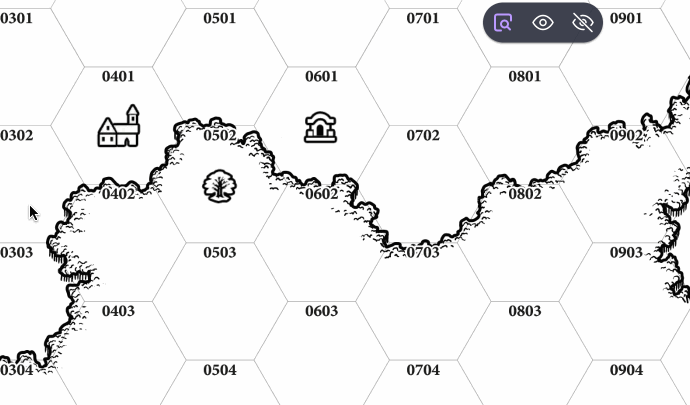

# Tidy Text

A lightweight extension for [Owlbear Rodeo](https://www.owlbear.rodeo/)
to quickly toggle the visibility of image labels.

## Installation

Use the "Add Custom Extension" button in Owlbear Rodeo, then paste in
`https://tidytext.toadkingdom.com/manifest.json` as the Install Link.

## Usage

With the tool selected, clicking on an object (prop, character, etc.)
either hides an existing label or restores a hidden label.

The extension also includes "hide all" and "show all" buttons that can be
used while the tool is active.

If new text is added to an object that already has hidden text, the texts
are concatenated on hide/show to avoid losing any data.

## Development

To install dependencies run:

`npm install`

To run in development mode run:

`npm run dev`

To build for deployment run:

`npm run build`

## License

MIT
